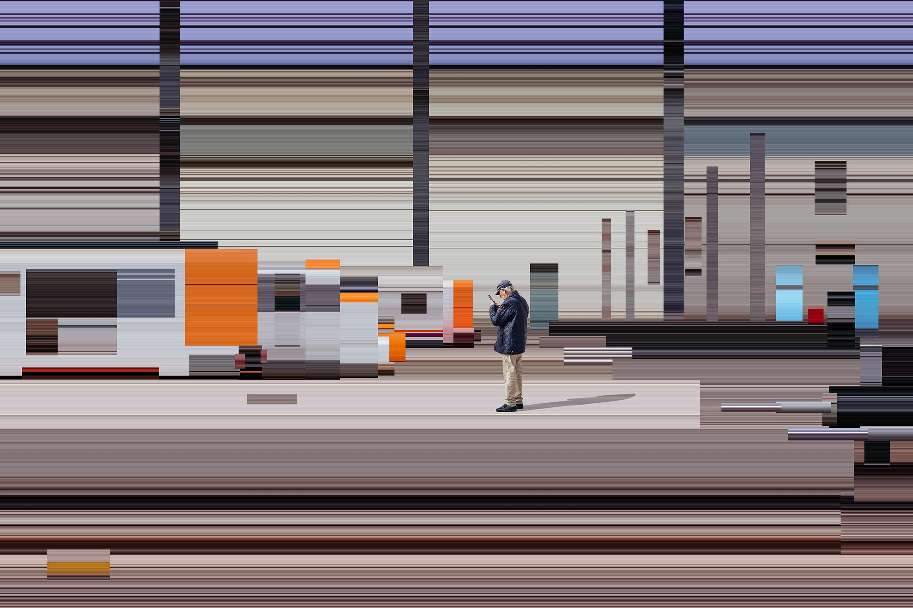

## Overview

Before Netflix, before Film TikTok, before AI movies, what was "Cinema," and what is left of it today? This course explores the many afterlives of cinema in what has been called the post-cinematic age, when the twentieth-century cultural dominance of film and television has been displaced by video games, social media platforms, and today's algorithmic technologies. Contrary to the endless proclamations of its demise, the course suggests, cinema today is proving to be surprisingly resilient in the face of the rapid technological and social transformations of the twenty-first century. Challenging the concept of the post-cinematic, the course focuses not only on the continuing development of film production and distribution infrastructures around the globe but also the persistence of the cinematic as a global cultural form and aesthetic, from Marvel's cinematic universe to cinematic VR and now cinematic AI. As Hollywood and other film industries worldwide scramble yet again to adjust to the arrival of another disruptive technology, the course suggests that far from heralding the end of cinema, AI may turn out to have been the beginning of a new chapter in its long and turbulent history.

## Format

This is primarily a critical-thinking course, although it includes a practical and production component. This means that it encourages you to think reflexively and analytically about the digitally-mediated cultural practices that the course considers, as well as to participate in them; for example, you will be invited to experiment with image-synthesis and text-generating software and analyze the results using key concepts and theoretical frameworks.

## Course Texts

Selected chapters from the texts below will be made available as PDFs; you are nevertheless encouraged to purchase at least several of texts that are of interest and read more of them.

Shane Denson and Julia Leyda, eds. [*Post-Cinema: Theorizing 21st-Century Film*](https://reframe.sussex.ac.uk/post-cinema/). Sussex: REFRAME Books, 2015. Please download {[pdf](https://reframe.sussex.ac.uk/wp-content/uploads/2019/05/POST-CINEMA_HI_RES.pdf)}.

Steve Gibson, Stefan Arisona, Donna Leishman, and Atau Tanaka, eds., *Live Visuals: History, Theory, Practice* (New York: Routledge, 2023).

Steven Shaviro, *Post-Cinematic Affect*. Washington: Zero Books, 2010.

Steven Shaviro, *The Rhythm Image: Music Videos and New Audiovisual Forms*. New York: Bloomsbury Academic, 2022.

Maria Vélez-Serna, *Ephemeral Cinema Spaces: Stories of Reinvention, Resistance and Community*. Amsterdam: Amsterdam University Press, 2020. [Intro](https://vimeo.com/572073770)

Holly Willis, *Fast Forward: The Future(s) of the Cinematic Arts*. New York and London: Wallflower Press, 2016.

Note on formats: A number of texts listed in the [Bibliography](bibliography) are available as e-books and/or audiobooks. You are encouraged to make use not only of print media but also of these screen-based and audio formats.

## Course Requirements

1. Regular attendance of and preparation for class. Absences will negatively affect your final grade. Active participation will help improve your final grade. Readings should be completed by the date listed on the syllabus.

2. Short written or video responses to reading and viewing assignments each week. Questions or prompts will be suggested in class the previous week. Please be prepared to present your text or video response in class.

You are allowed no more than one missing assignment; late assignments (i.e. assignments received after class and up to 7 days afterwards) will count as half-complete (i.e., you are allowed no more than two late assignments).

3. Presentation (2) (20-30 minutes) of readings and relevant materials, followed by moderation of discussion. Your presentation should summarize readings, highlight particularly interesting or controversial aspects, and connect them to other relevant materials (texts, films, videos, artworks, etc.) and contexts, as well as formulating questions that will help focus class discussion. Your task is essentially to frame and guide our discussion of the readings, and to insert them into our larger ongoing discussion.

4. Research paper or creative project

**Research Paper**

Write an 8-10 page (approx. 2,000-2,500 words) paper, including bibliography, on a topic of your choice relevant to the course. You will be expected to locate and read relevant source materials and use them as the basis of your paper. Try to identify a research question and/or hypothesis that the paper will explore.

**Creative Project**

As an alternative to a research paper, you may submit a creative project. If so, the project must be accompanied by statement on and/or documentation of 4-5 pages in length (1,000-1,250 words) that provides a conceptual overview of the project and contextualizes it in relation to the larger field of generative media practices.

## Assignments & Evaluation

- Weekly assignments (10) (25%)
- In-class presentation/discussion moderation (2 x 15% = 30%)
- Gaussian splat project (20%)
- Research paper or video essay (25%)

## Schedule of Classes

*Week 1*

01-14-26_Wed

**Film, Cinema and the Cinematic**

- [*The Definition of Film*](https://www.richardmisek.com/the-definition-of-film) (Richard Misek, 2015)
- [*Film*](https://youtu.be/lefvPUYGvi0) (Tacita Dean, 2011)

<iframe src="https://player.vimeo.com/video/128097765" width="100%" height="315" frameborder="0" allowfullscreen></iframe>

<iframe width="100%" height="315" src="https://www.youtube.com/embed/lefvPUYGvi0" frameborder="0" allowfullscreen></iframe>

---

*Week 2*

01-21-26_Wed

**Global Screens**

- Holly Willis, "[Past, Present, Future: Situating Post-Cinema](pdf/willis-fast-forward-ch1.pdf)" (in *Fast Forward: The Future(s) of the Cinematic Arts*)
- Franceso Casetti, "[The Relocation of Cinema](https://reframe.sussex.ac.uk/post-cinema/5-1-casetti/)" (in Denson and Leyda, eds., *Post-Cinema*)
- Matthias Stork, "[Chaos Cinema: The decline and fall of action filmmaking](https://pressplayredux.com/2011/08/22/video-essay-chaos-cinema-the-decline-and-fall-of-action-filmmaking/) (video essay series)
- [Global Phantasmagorias](https://www.youtube.com/playlist?list=PL3uFXkpHLYM5pryZRU9fbohIpwlaLuSzc) (YouTube playlist)

---

*Week 3*

01-28-26_Wed

**Social Media & Internet Movies**

- [*The Rise of Film TikTok*](https://youtu.be/iqajurNSp1Q) (Queline Meadows, 2020)
- [On Your Screen #3 - The Rise of Film TikTok](https://youtu.be/AYRoH3YNRM) \[podcast\]
- [*Criticism in the Age of TikTok*](https://youtu.be/uy8fgjghCQI) (Charlie Shackleton, 2019)
- Jason Kehe, "[The TikTok-Tailored Terpsichorean Trauma of *Encanto*](https://www.wired.com/story/disney-encanto-twerks-too-hard/)"
- Yasmin Tayag, "[*Cocaine Bear*: Why?](https://www.theatlantic.com/science/archive/2022/12/cocaine-bear-movie-animal-horror-appeal/672366/)"
- Angela Watercutter, "[*Cocaine Bear* and the New Age of Internet Movies](https://www.wired.com/story/new-era-internet-movies/)"
- Marah Eakin, "[*Bodies Bodies Bodies* Is a Slasher Movie for the Extremely Online](https://www.wired.com/story/bodies-bodies-bodies-is-a-slasher-movie-for-the-extremely-online/)"
- David Sims, "[*M3GAN*'s Killer-Robot Doll Is Just What 2023 Needs](https://www.theatlantic.com/culture/archive/2023/01/m3gan-horror-movie-review/672672/)"
- Angela Watercutter, "[The *M3GAN* Dance Meme: Vicious Dolls Could Dominate 2023](https://www.wired.com/story/m3gan-meme-twitter-tiktok-beyonce-megan-thee-stallion/)"

---

*Week 4*

02-04-26_Wed

**The Post-Cinematic**

- Shane Denson and Julia Leyda, "[Perspectives on Post-Cinema: An Introduction](https://reframe.sussex.ac.uk/post-cinema/introduction/)"
- Steven Shaviro, "[Post-Continuity: An Introduction](https://reframe.sussex.ac.uk/post-cinema/1-2-shaviro/)"
- Steven Shaviro, "[Introduction](pdf/shaviro-postcinematic-affect.pdf)" (*Post-Cinematic Affect*)

Watch: *Boarding Gate*

---

*Week 5*

02-11-26_Wed

**The Rhythm Image**

- Steven Shaviro, "[The Rhythm Image](pdf/shaviro-rhythm-image-intro.pdf)" (from *The Rhythm Image*)

See also: Steven Shaviro, [*Out of Whack: The Aberrant Identity of Tierra Whack*](https://flugschriften.com/wp-content/uploads/2018/12/Flugschriften-1-Steven-Shaviro-Out-of-Whack-1.pdf) (*Flückschriften*, 2016)

Music videos by Chemical Brothers, Lorde, Michel Gondry

---

*Week 6*

02-18-26_Wed

NO CLASS (Monday schedule)

---

*Week 7*

02-25-26_Wed

**Visual Music**

- Steve Gibson, "[Introduction: The Long History of Moving Images Becoming Alive](pdf/live-visuals-intro.pdf)" (in *Live Visuals: History, Theory, Practice*)
- [Interview with Greg Hermanovic](pdf/greg-hermanovic-interview.pdf) (TouchDesigner) (in *Live Visuals: History, Theory, Practice*)
- [*Audioreactive*](https://mroberts1.github.io/audioreactive) (blog)
- [*Audioreactive Playhead - Test*](https://emerson.hosted.panopto.com/Panopto/Pages/Viewer.aspx?id=b473f95a-c71e-4b26-bea7-b3fc0130fd5d) (MR)

---

*Week 8*

03-04-26_Wed

**Live Cinema**

- [Interview with Christopher Thomas Allen](pdf/light-surgeons-interview.pdf) (in *Live Visuals: History, Theory, Practice*)
- The Light Surgeons, [SuperEverything](http://supereverything.net/the-light-surgeons/)
- Martin Roberts, "[Moving Targets: Object Detection and Algorithmic Aesthetics](https://mroberts1.github.io/moving-targets/)"
- Holly Willis, "[Live Cinema](pdf/willis-live-cinema.pdf)" (in *Fast Forward: The Future(s) of the Cinematic Arts*)

---

SPRING BREAK

---

*Week 9*

03-18-26_Wed

**Bullet Time**

- Andreas Sudmann, "[Bullet Time and the Mediation of Post-Cinematic Temporality](https://reframe.sussex.ac.uk/post-cinema/3-2-sudmann/)" (in Denson and Leyda, eds., *Post-Cinema*)

---

*Week 10*

03-25-26_Wed

**Volumetric Cinema**

- Holly Willis, "New Practices / New Paradigms" (in *Fast Forward: The Future(s) of the Cinematic Arts*)
- Lev Manovich, "[Navigable Space](https://manovich.net/content/04-projects/022-navigable-space/18_article_1998.pdf)" (1998)
- Kevin L. Ferguson, "Volumetric Cinema" (in Denson and Leyda, eds., *Post-Cinema*)
- [Radiance Fields](https://radiancefields.com/) (website)
- [Arrival.Space](https://arrival.space/welcome)
- [Gracia](https://www.gracia.ai/)

Watch: [Volumetric Cinema](https://vimeo.com/119790662) (Kevin L. Ferguson)

<iframe src="https://player.vimeo.com/video/119790662" width="100%" height="315" frameborder="0" allowfullscreen></iframe>

---

*Week 11*

04-01-26_Wed

**Ecocinema**

- Selmin Kara, "Anthropocenema: Cinema in the Age of Mass Extinctions" (in Denson and Leyda, eds., *Post-Cinema*)
- Shane Denson, "Post-Cinema After Extinction"

---

*Week 12*

04-08-26_Wed

**Ephemeral Cinema**

Maria Vélez-Serna, *Ephemeral Cinema Spaces: Stories of Reinvention, Resistance and Community*:

- "Introduction"
- "Unstable constellations: recognizing cinema out of place" (ch. 1)

---

*Week 13*

04-15-26_Wed

**Immersive Environments**

- Holly Willis, "Virtual Reality and the Networked Self" (in *Fast Forward: The Future(s) of the Cinematic Arts*)
- [Hyperallergic article](https://hyperallergic.com/749447/we-met-in-virtual-reality-review/)
- [Hunting Interview](https://immerse.news/as-organic-as-a-real-camera-an-interview-with-joe-hunting-4fd4ea28845b)

Watch: *We Met in Virtual Reality*

---

*Week 14*

04-22-26_Wed

**Cinematic AI**

- [FlowTV](https://labs.google/flow/tv/channels)

---

*Week 15*

04-29-26_Wed

**Conclusion**

05-01-26_Fri **Last day of classes**

## Policies

**Academic Honesty**

It is the responsibility of all Emerson students to know and adhere to the College's policy on plagiarism, which can be found at [emerson.edu/policies/plagiarism](https://emerson.edu/policies/plagiarism "Plagiarism"). If you have any question concerning the Emerson plagiarism policy or about documentation of sources in work you produce in this course, speak to your instructor.

**Diversity**

Every student in this class will be honored and respected as an individual with distinct experiences, talents, and backgrounds. Issues of diversity may be a part of class discussion, assigned material, and projects. The instructor will make every effort to ensure that an inclusive environment exists for all students. If you have any concerns or suggestions for improving the classroom climate, please do not hesitate to speak with the course instructor or to contact the Social Justice Center at 617-824-8528 or by email at [sjc@emerson.edu](mailto:sjc@emerson.edu).

**Discrimination, Harassment, or Sexual Violence**

If you have been impacted by discrimination, harassment, or sexual violence, I am available to support you, and help direct you to available resources on and off campus. Additionally, the Office of Equal Opportunity ([oeo@emerson.edu](mailto:oeo@emerson.edu); 617-824-8999) is available to meet with you and discuss options to address concerns and to provide you with support resources. Please note that because I am an Emerson employee, any information shared with me related to discrimination, harassment, or sexual violence will also be shared with the Office of Equal Opportunity. If you would like to speak with someone confidentially, please contact the Healing & Advocacy Collective, the Emerson Wellness Center, or the Center for Spiritual Life.

**Accessibility**

Emerson is committed to providing equal access and support to all students who qualify through the provision of reasonable accommodations, so that each student may fully participate in the Emerson experience. If you have a disability that may require accommodations, please contact Student Accessibility Services (SAS) at [SAS@emerson.edu](mailto:SAS@emerson.edu) or 617-824-8592 to make an appointment with an SAS staff member.

Students are encouraged to contact SAS early in the semester. Please be aware that accommodations are not applied retroactively.

**Writing & Academic Resource Center**

Students are encouraged to visit and utilize the staff and resources of Emerson's Writing Center, particularly if they are struggling with written assignments. The Writing Center is located at 216 Tremont Street on the 5th floor (tel. 617-824-7874).

**In-Class Recording**

Regardless of modality or whether this course is being recorded by the College with the permission of the students for classroom purposes, this class is considered a private environment and it is a setting in which copyrighted materials, creative works and educational records may be displayed. Audio or video recording, filming, photographing, viewing, transmitting, producing or publishing the image or voice of another person or that person's materials, creative works or educational records without the person's knowledge and expressed consent is strictly prohibited.
